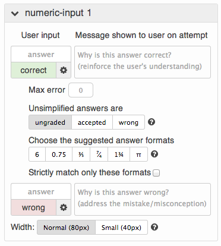

# Math Input Menagerie

## Components

### `InputWithExamples`

A `MathInput` or `TextInput` that has an acceptable formats popover.

Used in three widgets - `Expression`, `NumericInput`, and `InputNumber` (all of the widgets in this doc less `OldExpression`).

#### `MathInput`

A mathquill react component. *Only* used in `InputWithExamples`.

#### `TextInput`

Pretty much just an input. *Only* used in `InputWithExamples` (and `ExampleWidget`). This component is honestly confusing to me since as far as I can tell it only differs from `<input type="text">` by calling `onChange` with the new value rather than an event and by providing a `focus` method.

### `NumberInput`

This is used in `NumericInput` as well as several other widgets.

```
Calls onChange(value, format) for valid numbers.

Reverts to the current value onBlur or on [ENTER],
  but maintains the format (i.e. 3/2, 1 1/2, 150%)
   
Accepts empty input and sends it to onChange as null
  if no numeric placeholder is set.
  
If given a checkValidity function, will turn
  the background/outline red when invalid
  
If useArrowKeys is set to true, up/down arrows will
  increment/decrement integers
  
Optionally takes a size ("mini", "small", "normal")
```

## Widgets

### `Expression`

Widget called "Expression / equation" that displays a mathquill box (`InputWithExamples`).

This expression is also an example of `InputWithExamples` and `MathInput`.


### `OldExpression`

Also called "Expression / equation". The expression widget seen on mobile. It's unclear to the author how the input works as it appears to be using a mathquill input but also displaying the latest parsed TeX.

### `InputNumber`

Widget called "Number text box" for simple number entry.

### `NumericInput`

A newer version of `InputNumber`. This looks exactly the same to the user:


... but `NumericInput` is more sophisticated behind the scenes than `InputNumber`.



